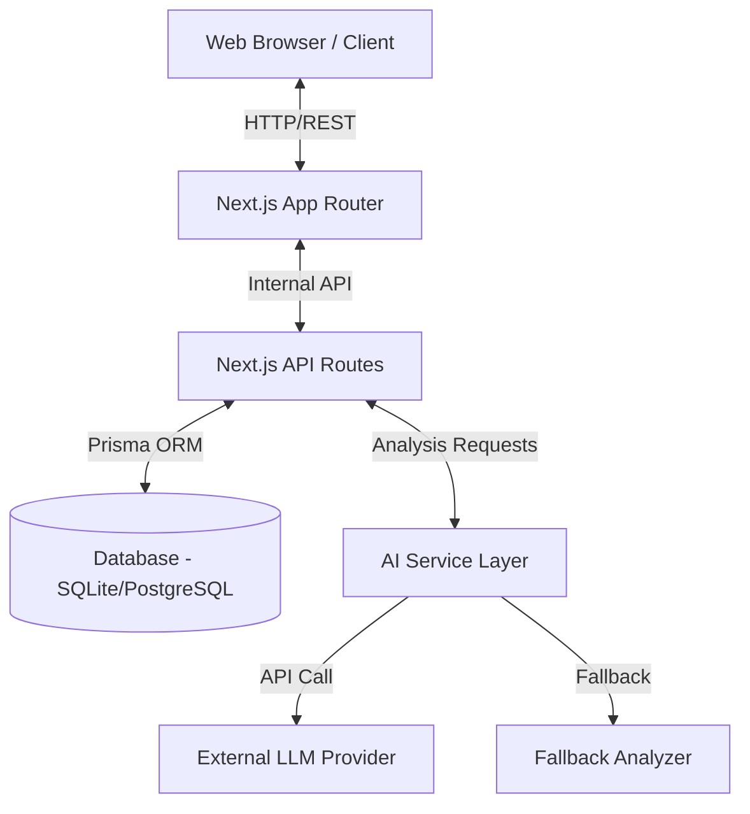
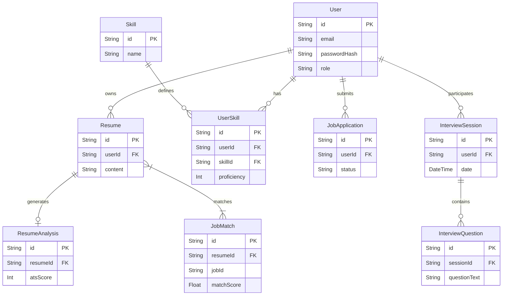
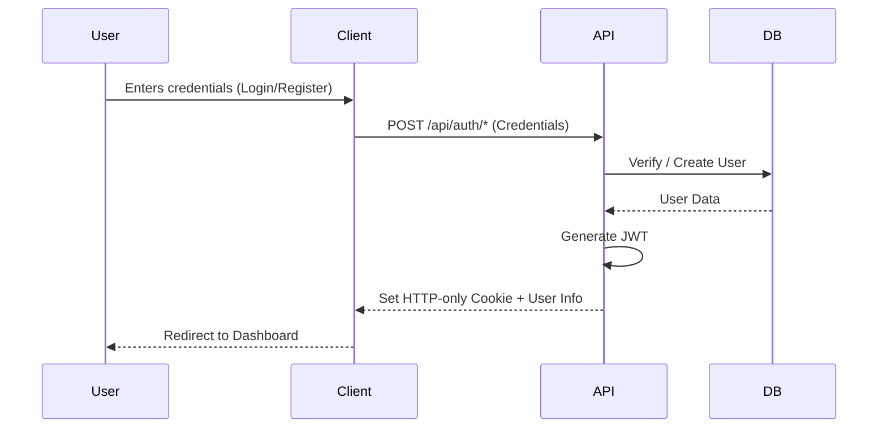
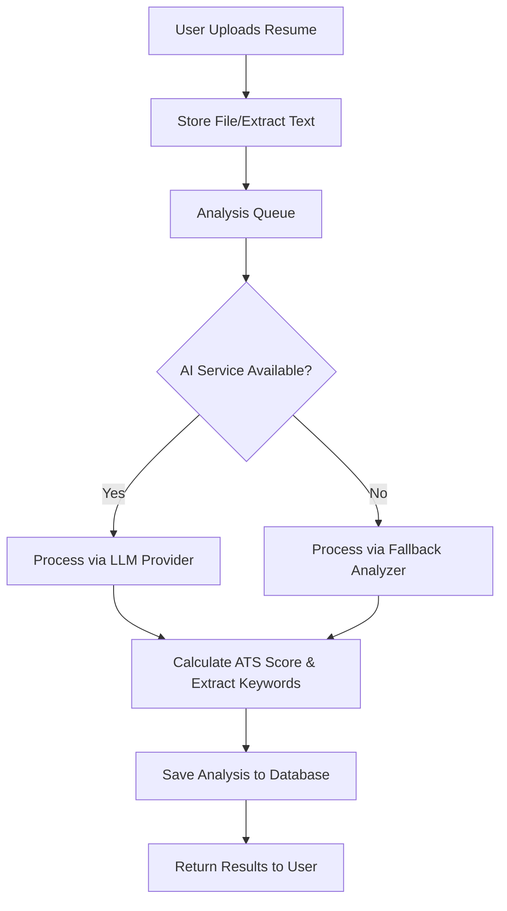

# System Architecture

This document outlines the architecture of the CareerPilot platform.

## High-Level Architecture



## Frontend Architecture

CareerPilot uses the **Next.js App Router** paradigm, providing a mix of Server Components and Client Components.
- **Server Components**: Used for data fetching, SEO optimization, and reducing client-side bundle size (e.g., Dashboard layout, static pages).
- **Client Components**: Utilized for interactive UI elements, state management, and form handling (e.g., file uploads, dynamic charts).
- **Component Hierarchy**: Follows an atomic design principle, separating UI components (buttons, inputs) from feature-specific components (ResumeUploader, JobCard).

## Backend Architecture

The backend is built directly into Next.js using **API Routes** (`app/api/*`).
- **Middleware**: Used for authentication and authorization checks before requests reach specific routes.
- **Controllers/Services**: Business logic is decoupled from route handlers and resides in dedicated service files (e.g., `services/resume.service.ts`).

## Database Architecture



## AI Architecture

The AI module is responsible for intelligent analysis.
- **AIService**: The central interface for AI operations.
- **LLMProvider**: Connects to external Large Language Models for advanced NLP tasks.
- **FallbackAnalyzer**: A rule-based local analyzer that takes over if the external LLM is unavailable or for basic tier requests, ensuring the system remains functional.

## Auth Flow



## Resume Analysis Flow



## Job Matching Flow

1. Extract core skills and experience from the parsed resume.
2. Query available jobs from the database.
3. Compare resume keywords against job requirements.
4. Calculate a match percentage based on term frequency and semantic similarity (if AI-enabled).
5. Return ranked job listings.

## File Upload Flow with Security

1. Client selects a file (PDF/TXT).
2. Client-side validation (size < 5MB, correct MIME type).
3. Secure POST request to backend.
4. Backend re-validates MIME type and size.
5. Filename is sanitized to prevent path traversal attacks.
6. File is stored securely (local dev) or in cloud storage (prod).
7. Path/URL is recorded in the database.

## Folder Structure

```
careerpilot/
├── app/               # Next.js App Router (Pages & API)
│   ├── api/           # API routes
│   └── (routes)/      # Frontend pages
├── components/        # Reusable React components
│   ├── ui/            # Basic UI elements
│   └── features/      # Feature-specific components
├── lib/               # Utility functions, Prisma client
├── prisma/            # Database schema & migrations
├── public/            # Static assets
└── styles/            # Global CSS (Tailwind)
```
